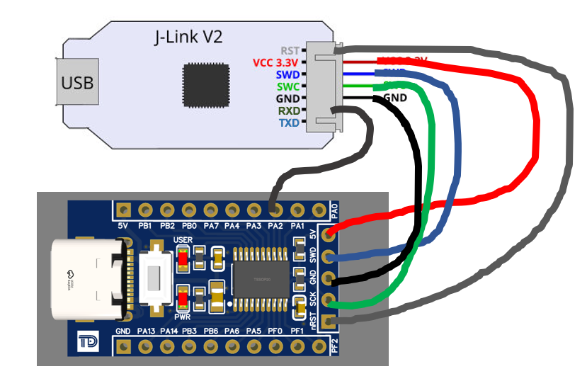

# PY32F0 Template Project for Windows

Fork from: https://github.com/IOsetting/py32f0-template with modify makefile to support Windows

* Puya PY32F0 seriees template project for GNU Arm Embedded Toolchain
* Supported programmers: J-Link
* Supported IDE: VSCode

# Puya PY32F0 Family

* PY32F002
  * PY32F002x5(20KB Flash/3KB RAM)
* PY32F002A
  * PY32F002Ax5(20KB Flash/3KB RAM)
* PY32F003
  * PY32F003x4(16KB Flash/2KB RAM), PY32F003x6(32KB Flash/4KB RAM), PY32F003x8(64KB Flash/8KB RAM)
* PY32F030
  * PY32F030x4(16KB Flash/2KB RAM), PY32F030x6(32KB Flash/4KB RAM), PY32F030x7(48KB Flash/6KB RAM), PY32F030x8(64KB Flash/8KB RAM)
* PY32F072
  * PY32F072xB(128KB Flash/16KB RAM)

**Note**

There is high probability that PY32F002A, PY32F003 and PY32F030 share the same core, you can treat them all as PY32F030 in coding and programming.

# File Structure

```
├── Build                       # Build results
├── Docs                        # Datesheets and User Manuals
├── Examples
│   ├── FreeRTOS                # FreeRTOS examples
│   ├── HAL                     # HAL library examples
│   └── LL                      # LL(Low Layer) library examples
├── Libraries
│   ├── BSP                     # SysTick delay and printf for debug
│   ├── BSP_LL                  # SysTick delay and printf for debug
│   ├── CMSIS
│   ├── FreeRTOS                # FreeRTOS library
│   ├── LDScripts               # LD files
│   ├── PY32F0xx_HAL_Driver     # MCU peripheral driver
│   └── PY32F0xx_LL_Driver      # MCU low layer peripheral driver
├── Makefile                    # Make config
├── Misc
│   ├── Flash
│   │   ├── JLinkDevices        # JLink flash loaders
│   │   └── Sources             # Flash algorithm source code
│   ├── Puya.PY32F0xx_DFP.x.pack # DFP pack file for PyOCD
│   └── SVD                     # SVD files
├── README.md
├── rules.mk                    # Pre-defined rules include in Makefile 
└── User                        # User application code
```

# Requirements

* PY32F0 EVB or boards of PY32F002/003/030 series: https://linhkienthuduc.com//product/search?search=PY32
* Programmer
  * J-Link: J-Link OB programmer: https://linhkienthuduc.com/jlink-ob-072-mach-nap-cho-arm-cortex-m
* SEGGER J-Link Software and Documentation pack [https://www.segger.com/downloads/jlink/](https://www.segger.com/downloads/jlink/)
* GNU Arm Embedded Toolchain
* Make 

# Building

## 1a. Install GNU Arm Embedded Toolchain

Download the toolchain from [Arm GNU Toolchain Downloads](https://developer.arm.com/downloads/-/arm-gnu-toolchain-downloads) according to your pc architecture, extract the files and install:

**Note: Don't download Cortex-M PACBTI Version**

## 1b. Install Make
Download make 3.81 Binaries from: https://gnuwin32.sourceforge.net/packages/make.htm

**Note: Add Make path to PATH: C:\Program Files (x86)\GnuWin32\bin**

## 2. : Install SEGGER J-Link (Must)

Download and install JLink from [J-Link / J-Trace Downloads](https://www.segger.com/downloads/jlink/).

Must: Copy [Project directory]/Misc/Flash/JLinkDevices to C:\Users\[Users]\AppData\Roaming\SEGGER\JLinkDevices\

Read more: [https://wiki.segger.com/J-Link_Device_Support_Kit](https://wiki.segger.com/J-Link_Device_Support_Kit)

## 3. Clone This Repository

Clone this repository to local workspace
```
git clone https://github.com/TDLOGY/py32f0-template-project
```

Or download directly from link: https://github.com/TDLOGY/py32f0-template-project

## 4. Edit Makefile

Change the settings in Makefile
* **USE_LL_LIB** Puya provides two sets of library, HAL and LL, set `USE_LL_LIB ?= y` to use LL instead of HAL.
* **ENABLE_PRINTF_FLOAT** set it to `y` to `-u _printf_float` to link options. This will increase the binary size.
* **USE_FREERTOS** Set `USE_FREERTOS ?= y` will include FreeRTOS in compilation
* **USE_DSP** Include CMSIS DSP or not
* **FLASH_PROGRM**
  * If you use J-Link, `FLASH_PROGRM` jlink
  * ST-LINK is not supported yet.
* **ARM_TOOCHAIN** Make sure it points to the correct path of arm-none-eabi-gcc

```makefile
##### Project #####

PROJECT           ?= app
# The path for generated files
BUILD_DIR         = Build


##### Options #####

# Use LL library instead of HAL, y:yes, n:no
USE_LL_LIB        ?= n
# Enable printf float %f support, y:yes, n:no
ENABLE_PRINTF_FLOAT ?= n
# Build with FreeRTOS, y:yes, n:no
USE_FREERTOS      ?= n
# Build with CMSIS DSP functions, y:yes, n:no
USE_DSP           ?= n
# Programmer, jlink or pyocd
FLASH_PROGRM      ?= pyocd

ifeq ($(detected_OS),WIN)     # is Windows_NT on XP, 2000, 7, Vista, 10...
ARM_TOOCHAIN	?= C:/Program Files (x86)/Arm GNU Toolchain arm-none-eabi/12.2 rel1/bin
JLINKEXE		?= C:/Program Files/SEGGER/JLink/JLink
else
ARM_TOOCHAIN	?= /opt/gcc-arm/arm-gnu-toolchain-12.2.rel1-x86_64-arm-none-eabi/bin
JLINKEXE		?= /opt/SEGGER/JLink/JLinkExe
endif

# JLink device type, options:
#   PY32F002AX5, PY32F002X5, 
#   PY32F003X4, PY32F003X6, PY32F003X8, 
#   PY32F030X4, PY32F030X6, PY32F030X7, PY32F030X8
JLINK_DEVICE      ?= PY32F030X6
# path to PyOCD, 
PYOCD_EXE         ?= pyocd
# PyOCD device type, options: 
#     py32f002ax5, py32f002x5, 
#   py32f003x4,  py32f003x6, py32f003x8, 
#   py32f030x3,  py32f030x4, py32f030x6, py32f030x7, py32f030x8
#   py32f072xb
PYOCD_DEVICE      ?= py32f030x8


##### Paths ############

# Link descript file: py32f002x5.ld, py32f003x6.ld, py32f003x8.ld, py32f030x6.ld, py32f030x8.ld
LDSCRIPT          = Libraries/LDScripts/py32f002x5.ld
# Library build flags: 
#   PY32F002x5, PY32F002Ax5, 
#   PY32F003x4, PY32F003x6, PY32F003x8, 
#   PY32F030x3, PY32F030x4, PY32F030x6, PY32F030x7, PY32F030x8, 
#   PY32F072xB
LIB_FLAGS         = PY32F030x6
```

## 5. Compiling And Flashing

```bash
# clean source code
make clean
# build
make
# or make with verbose output, Linux only
V=1 make
# flash
make flash
# erase
make erase
```
# Hardware connection



Signal Name | Kit | Jlink
--- | --- | --- | 
VCC | 5V | VCC 3.3V
GND | GND | GND
SWCLK | SCK | SWCLK
SWDIO | SWD | SWDIO
RESET | nRST | RST
MCU_UART_TX | PA2 | RXD
MCU_UART_RX | PA1 | TXD


# Debugging In VSCode

Install Cortex Debug extension, add a new configuration in launch.json, e.g.
```
{
    // Use IntelliSense to learn about possible attributes.
    // Hover to view descriptions of existing attributes.
    // For more information, visit: https://go.microsoft.com/fwlink/?linkid=830387
    "version": "0.2.0",
    "configurations": [
        {
            "cwd": "${workspaceRoot}",
            "executable": "${workspaceFolder}/Build/app.elf",
            "name": "Debug Microcontroller",
            "request": "launch",
            "type": "cortex-debug",
            "servertype": "jlink",
            "serverpath": "C:/Program Files/SEGGER/JLink/JLinkGDBServerCL.exe",
            "armToolchainPath": "C:/Program Files (x86)/Arm GNU Toolchain arm-none-eabi/12.2 rel1/bin",
            "device": "PY32F030X8",
            "interface": "swd",
            "serialNumber": "", // add J-Link serial number if having multiple attached the same time.
            "svdFile": "${workspaceFolder}/Misc/SVD/py32f030xx.svd",

            "showDevDebugOutput": "vscode", // parsed, raw, vscode:vscode log and raw
            "runToEntryPoint": "main", // "main" or other function name. runToMain is deprecated
            "preLaunchTask": "build",  // Set this to run a task from tasks.json before starting a debug session
        }
    ]
}
```

task.json
```
{
    // See https://go.microsoft.com/fwlink/?LinkId=733558
    // for the documentation about the tasks.json format
    "version": "2.0.0",
    "tasks": [
        {
            "label": "build",
            "type": "shell",
            "command": "make -j4"
        }
    ]
}
```

# Try Other Examples

More examples can be found in *Examples* folder, copy and replace the files under *User* folder to try different examples.

# Links

* Puya Product Page(Datasheet & SDK download): https://www.puyasemi.com/cpzx3/info_267_aid_242_kid_235.html
